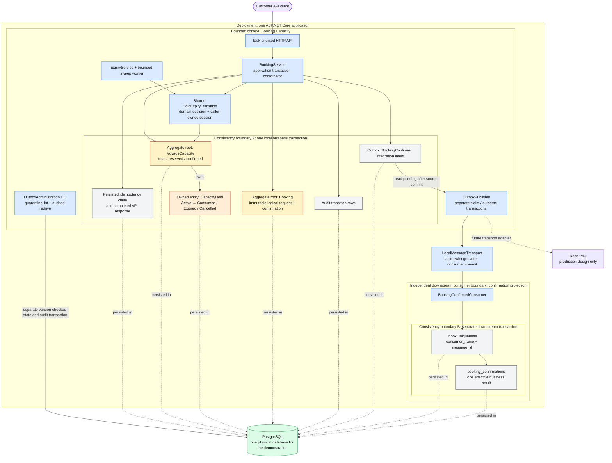

# Context, aggregates and consistency boundaries

[Open the rendered diagram at full size](context-aggregates.svg). The Mermaid source below remains editable.

Legend: blue = executing component; amber = aggregate root; orange = owned entity; gray = durable supporting state; purple = external participant; green = physical database. Named containers distinguish deployment, bounded context and transaction scope. Solid arrows show calls, ownership or delivery; dotted arrows show physical persistence or a future adapter.

The diagram shows confirmation's full transaction scope. Create and cancellation use the relevant subset, while expiry has no API idempotency claim. The expiry worker still locks voyage → booking → hold and commits its state/counter/audit changes together. Background polling is scheduling, not durable business ownership.

| Concept | Selected boundary |
|---|---|
| Bounded context | Booking Capacity defines the shared language and invariants for this narrow source capability. The downstream projection demonstrates a consumer that owns independent state. |
| Aggregate | `VoyageCapacity` owns limited-resource accounting and its holds; `Booking` owns the logical request and one confirmation. `CapacityHold` has identity/lifecycle but is an entity inside capacity ownership. |
| Value object | `CapacityUnits` validates positive whole units; `HoldDeadline` defines strict confirmation and inclusive expiry comparisons. |
| Transaction | Boundary A deliberately spans both roots plus the relevant support records. Boundary B atomically commits inbox identity and the downstream projection, on a separate connection/transaction. |
| Repository operations | `BookingPersistenceSession` provides ordered loading, database time and SQL writes. `HoldExpiryTransition` shares the domain expiry decision; `IdempotentCommandExecutor` coordinates durable API replay. Each helper uses the caller-owned transaction. Root counters plus one target/relevant active hold are loaded; historical aggregate collections are not materialized. |
| Integration | `BookingConfirmedMessage` is the versioned contract. Source confirmation is complete before the publisher runs. At-least-once delivery can duplicate this message; Boundary B protects its effective result. |
| Physical storage | Both boundaries use one PostgreSQL database in the demonstration. The downstream tables have no foreign keys to source bookings or outbox, and the consumer does not join source tables. Shared hardware does not make the two commits atomic. |
| Deployment | API, workers and demonstration consumer run in one application. A bounded context, aggregate, table, broker topic/queue and deployment unit are distinct concepts. No separate microservice deployment is needed. |

The coordinator synchronously consumes the hold and confirms the booking; a domain event handler is not used to split that local invariant across transactions. Lifecycle facts are retained in `audit_transitions`. Publication is the first asynchronous reliability boundary, and the publisher never holds a source business transaction open while delivering a message.

The accepted trade-off is serialization of all mutating operations for a hot voyage. The transaction boundary makes this correctness cost explicit; more application instances cannot remove it. A future external payment step belongs to a durable distributed process outside Boundary A, which must remain short and local.
