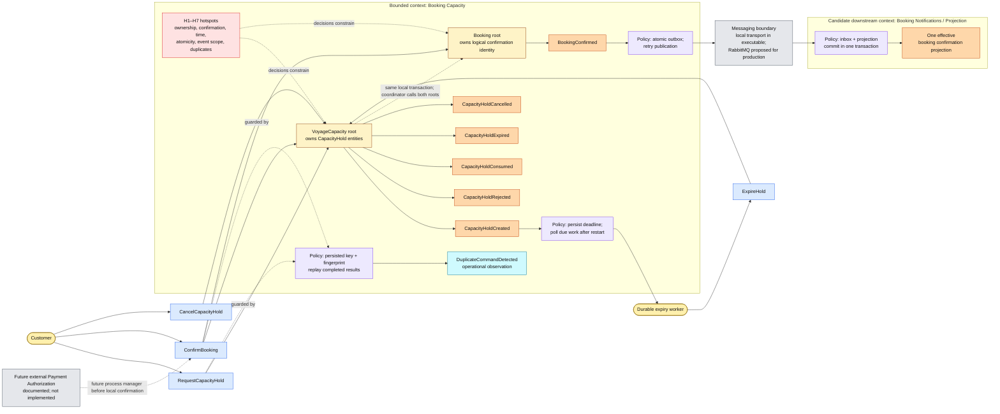

# Focused Event Storming model

[Open the rendered diagram at full size](event-storming.svg). The Mermaid source below remains editable.

This model fixes the vocabulary, ownership and race decisions for the implementation. It describes business facts and policies; arrows between facts do not imply separate services or asynchronous processing. Creation and confirmation remain synchronous local transactions. Only the outbox publication crosses an integration boundary.

Legend: rounded yellow = actor; blue = command; orange = business event/fact; amber = aggregate; purple = policy; gray = external system or integration boundary; red = unresolved questions now resolved below; cyan = operational observation. Named groups are bounded-context choices, not deployment units. Dotted arrows indicate constraints, guards or future relationships.

| Event Storming category | Concrete model |
|---|---|
| Actors | Customer requests/confirms/cancels; expiry worker resumes persisted due work; outbox publisher is the system actor applying the publication policy. |
| Commands | `RequestCapacityHold`, `ConfirmBooking`, `CancelCapacityHold`, `ExpireHold`. The public service names are `CreateHoldAsync`, `ConfirmAsync`, `CancelAsync` and the expiry service methods. |
| Domain events | `CapacityHoldCreated`, `CapacityHoldConsumed`, `BookingConfirmed`, `CapacityHoldExpired`, `CapacityHoldCancelled`; `CapacityHoldRejected` records a rejected create decision. These are audit facts emitted by transaction coordination after domain decisions, not unused event-class scaffolding. |
| Policies | Deduplicate API operations in durable storage; reserve only available open-voyage capacity; decide using database time after locks; poll persisted deadlines; atomically record integration intent; retry delivery; deduplicate downstream within its own transaction. |
| Aggregates | `VoyageCapacity` owns counters and its `CapacityHold` entities. `Booking` owns immutable request binding and confirmation identity. |
| External systems | PostgreSQL provides durable storage; a messaging abstraction provides delivery, with a direct acknowledged local transport for the executable and RabbitMQ proposed for production; Payment Authorization is a future external dependency. |
| Hotspots | H1–H7 below establish ownership, deadline semantics, consistency, event scope and duplicate identity. |
| Candidate bounded contexts | Implemented source context: Booking Capacity. The small downstream confirmation projection demonstrates an independent consumer boundary. Future Payments is external; separate Voyage Planning/Booking Sales contexts are possible only when broader business ownership demands them. No extra services are implemented. |

`DuplicateCommandDetected` is deliberately modeled as an operational observation: a retry does not create a new reservation, confirmation or domain transition. The service logs the observation and returns the persisted original response. A reused scoped key with a different request fingerprint is a conflict. Only `BookingConfirmed` becomes a versioned integration event; hold lifecycle facts remain local audit records.

| Hotspot | Resolution and executable consequence |
|---|---|
| H1 — Who owns the capacity invariant? | `VoyageCapacity`. Every mutator locks its durable row; the transaction changes counters and corresponding hold/booking state together. Database checks prevent invalid counter totals. |
| H2 — Where does Capacity Hold belong? | A lifecycle entity owned by `VoyageCapacity`, stored separately for targeted access. It is not an independent service or aggregate. `Booking` remains a separate root for logical request identity. |
| H3 — When is Booking confirmed? | The decision is admitted only before the deadline while business locks are held. Confirmation becomes durable and externally successful when hold consumption, booking fields, audit, idempotent response and outbox commit together. Broker delivery is not part of that commit. |
| H4 — What wins confirmation versus expiry? | Read the database clock after all locks. Active + `decisionTime < expiresAt` permits confirmation; equality/later expires. A pre-deadline accepted decision may commit later. Expiry cannot release consumed capacity, and transaction-start time gives no priority. |
| H5 — Which state is strongly consistent? | Capacity counters, relevant hold, booking confirmation, completed idempotency result, audit and integration intent share one local transaction. Publication and downstream state are eventually consistent, with separate transactions. |
| H6 — Which events cross contexts? | Only `BookingConfirmed` is published. Local lifecycle/rejection facts are auditable; duplicate detection is operational. The downstream projection is independent of source tables and cannot determine whether a booking is authoritatively confirmed. |
| H7 — How are duplicates identified across instances? | API operations use database uniqueness over `(customer, operation-with-route, key)` plus a canonical typed fingerprint and stored result. Stable `BookingId` additionally blocks duplicate logical effects under different keys. Integration delivery uses persisted `(consumer_name, message_id)` uniqueness with its side effect in the same transaction. |

The main flow is reserve → consume → confirm, with consume and confirm in the same transaction. The alternate terminal paths are expire and cancel. Every terminal transition preserves allocated-capacity accounting and cannot be reversed. A replacement hold uses the same immutable booking request and a new operation key; it cannot revive an earlier expired/cancelled hold.
