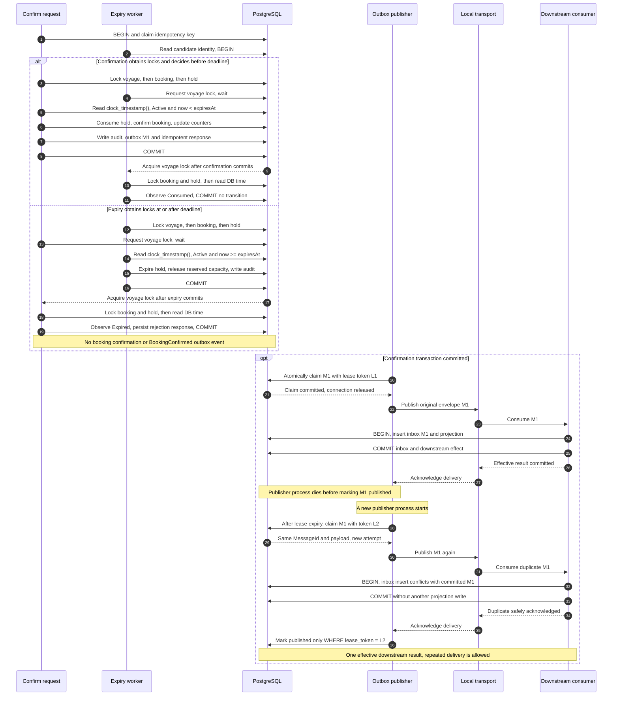

# Failure sequence: deadline race and duplicate publication

[Open the rendered diagram at full size](failure-sequence.svg). The Mermaid source below remains editable.

The first section shows both operations beginning before either business transaction commits. The confirmation decision uses a separate `clock_timestamp()` read **after** the voyage, booking and hold locks are acquired. Confirmation succeeds only for Active state with `decisionTime < expiresAt`; equality expires. A valid decision may commit after the deadline. The winner is defined by serialized state and this time check, not by HTTP arrival time.

If confirmation acquires the locks after the deadline while the hold still says Active, it performs the same expiry/release transition lazily and returns a rejection. If an expiry call acquires them before the deadline, it makes no transition. These cases obey the same decision rule. PostgreSQL holds the conflicting row locks to transaction end, so a waiting operation subsequently observes the committed state. [PostgreSQL row-level locking](https://www.postgresql.org/docs/current/explicit-locking.html#LOCKING-ROWS).

The publication section depicts the **implemented local transport**: acknowledgement follows the consumer's separate database commit. With the proposed RabbitMQ adapter, publisher confirmation establishes broker acceptance and the consumer acknowledges independently after its transaction. The repeated-MessageId/inbox protection is unchanged. [RabbitMQ confirmation boundaries](https://www.rabbitmq.com/docs/confirms).

The failure seams are `business.after-locks`, `confirm.after-decision`, `confirm.before-commit`, `consumer.before-commit` and `outbox.after-publish`. Integration tests inject gates or exceptions through internal DI; process recovery demonstrations terminate and relaunch the application against retained database state. A handled publication exception schedules a retry; a dead process leaves its lease to expire.
